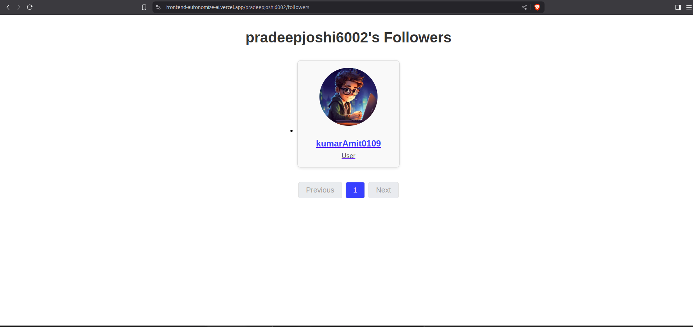
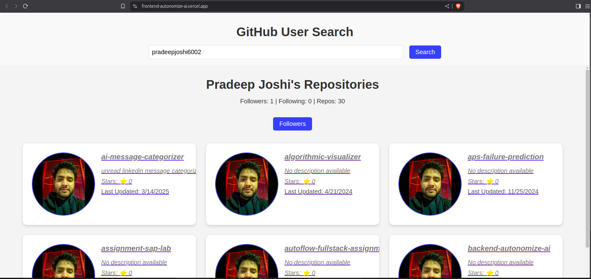

## **Features**

1. An initial page with a input box that accepts a GitHub username and a submit/search
button
2. On submit, show the list of repositories returned from above API (See image 1) for the
username entered in the input box. Display some useful user info above the repository
list. (Design not given in image1)

3. Clicking on any of the repositories should take us to a page which shows description
about that repository (See image 2)
4. Also on the repository list page near the user info, add a button / link that should lead to
a page with followers of the current user. (Design not given, you are free to choose any
simple design or you may follow a design similar to the repository list)
5. Clicking on any follower should display the repository list page of that user
6. Also there has to be a way to go back to the repository list page with the input box
